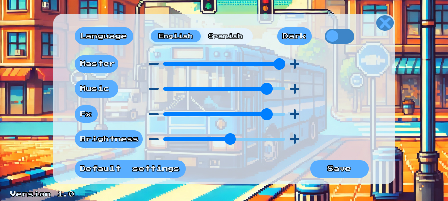
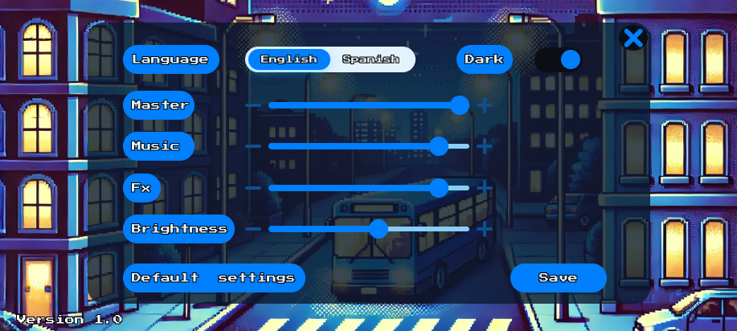
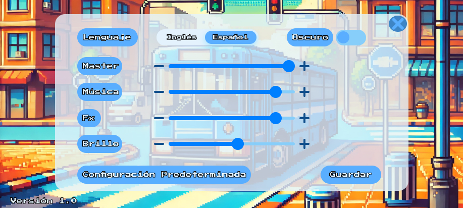
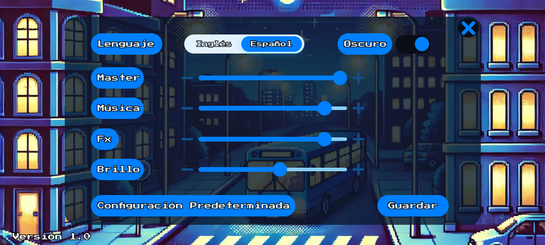
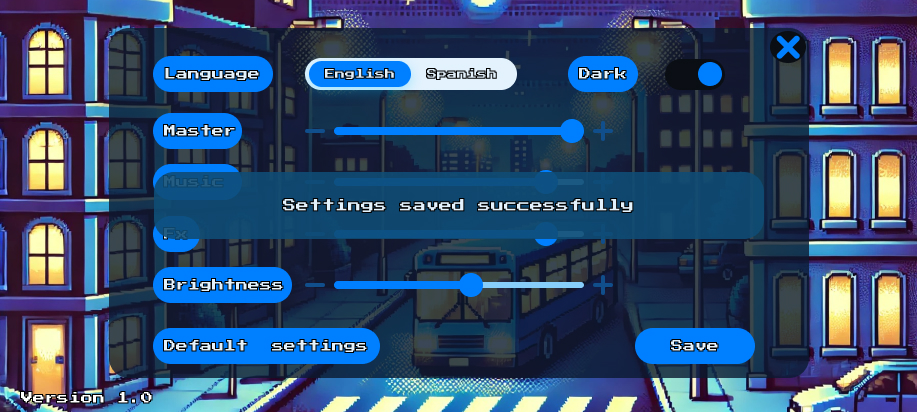
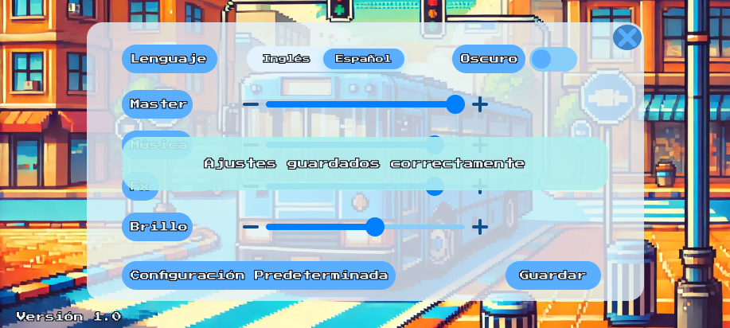
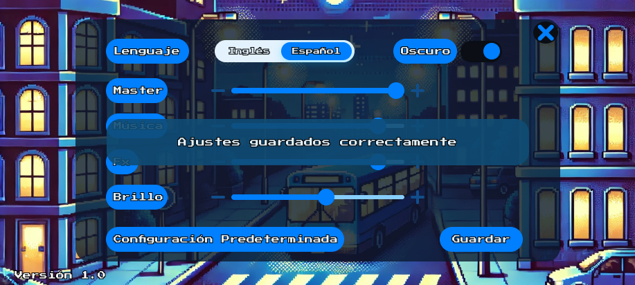

# Interfaz de configuración
## Descripción 
En el diseño de la interfaz de configuración se consideraron diversos requisitos para garantizar tanto la funcionalidad como la estética. Por ejemplo, se incluyó un control para ajustar el volumen de la música y los efectos de sonido (RF-012, RNF-016), ofreciendo de esta manera una experiencia personalizada. Asimismo, la paleta de colores fue seleccionada para asegurar una correcta visibilidad tanto en el modo claro como en el modo oscuro, favoreciendo una visualización adecuada en distintas condiciones de iluminación.

Además del control que modifica los sonidos del juego, se añadió otro para ajustar el brillo de la pantalla (RF-017), lo que permite una experiencia de juego más cómoda. También se implementó un botón para cambiar entre el modo claro y el modo oscuro de forma sencilla (RF-015), facilitando la personalización según las preferencias del usuario.

Para asegurar un uso accesible, se incluyeron dos idiomas disponibles (español e inglés) (RNF-006). Por último, se diseñó un botón para restablecer la configuración a los valores predeterminados (RF-018), permitiendo al usuario revertir cualquier cambio que no sea de su agrado. A continuación, se presentan los requisitos.

### Requisitos funcionales
- **RF-012:** El juego contará con un apartado de configuraciones donde podrá modificar el volumen de la música, el nivel del sonido, el idioma, etc.
- **RF-015:** El programa permitirá cambiar el color del fondo entre blanco y negro.
- **RF-018:** El juego debe incluir una opción para restablecer la configuración predeterminada en el menú de ajustes, permitiendo al usuario volver a los valores originales de sonido y brillo fácilmente.

### Requisitos no funcionales
- **RNF-006:** El programa debe ser capaz de ejecutarse en varios idiomas, siendo los principales español e inglés, pero con opción de agregar otros idiomas en el futuro.
- **RNF-016:** El juego debe poder activar o desactivar la música y efectos de sonido desde el menú de configuración.
- **RNF-017:** El juego debe permitir al usuario ajustar el brillo de la pantalla dentro de la aplicación para mejorar la visibilidad en diferentes condiciones de luz.

## Previsualización
### Modo Claro - Inglés

### Modo Oscuro - Inglés

### Modo Claro - Español

### Modo Oscuro - Español

### Configuración Guardada - Modo Claro (Inglés)

### Configuración Guardada - Modo Oscuro (Inglés)

### Configuración Guardada - Modo Claro (Español)

### Configuración Guardada - Modo Oscuro (Español)
