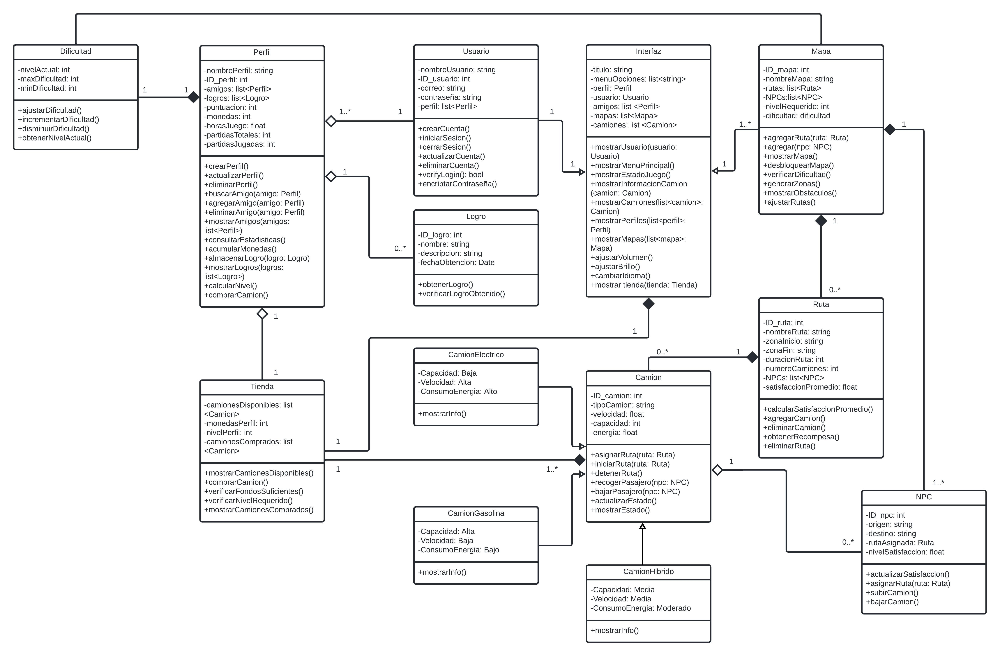

# Diagrama de clases UML por Juan Angel Canché Gongora y Christopher May Paat

---
El siguiente diagrama de clases presenta el funcionamiento del sistema.

---
## Explicación del diagrama

**Entidades y Requisitos del Proyecto**

---
### 1. Usuario
**Entidad:** Usuario  

**Requisitos Relacionados:**
- **RF-001:** Inicio de sesión con usuario y contraseña.
- **RF-019:** Registro de nuevos usuarios.
- **RNF-007:** Protección de credenciales mediante encriptación.
- **RNF-016:** Posibilidad de activar o desactivar la música y efectos de sonido.

**Justificación:**
- **Relación con Perfil:** Un Usuario puede tener múltiples Perfiles para gestionar diferentes partidas guardadas. (1 usuario puede tener muchos perfiles, y un perfil pertenece a un solo usuario).
- **Operaciones:** Métodos como `crearCuenta()`, `iniciarSesion()`, `cerrarSesion()` y `verificarLogin()` cumplen con RF-001 y RF-019, garantizando la seguridad mediante la encriptación de contraseñas (RNF-007).

### 2. Perfil
**Entidad:** Perfil  

**Requisitos Relacionados:**
- **RF-003:** Creación de un perfil local que guarde el progreso.
- **RF-014:** Posibilidad de agregar amigos.
- **RF-016:** Consulta de estadísticas del jugador.

**Justificación:**
- **Relación con Usuario:** Un Usuario puede tener múltiples Perfiles, lo cual le permite llevar distintos progresos (ejemplo: distintos modos de juego o diferentes niveles de dificultad).
- **Relación con Rutas, Camiones y Mapas:** El progreso almacenado en el perfil está relacionado con los Camiones adquiridos, las Rutas completadas, y los Mapas desbloqueados (RF-020, RF-021, RF-023).
- **Operaciones:** Acumula logros, monedas y muestra las estadísticas del jugador (RF-003, RF-016).

### 3. Tienda
**Entidad:** Tienda  

**Requisitos Relacionados:**
- **RF-010:** Permitir la compra de camiones con monedas recolectadas.
- **RF-006:** Sistema de recompensas para obtener monedas.

**Justificación:**
- **Relación con Camiones:** En la Tienda, los jugadores pueden adquirir Camiones, restringidos por el nivel del perfil y las monedas recolectadas (RF-010, RF-006).
- **Operaciones:** Métodos para verificar fondos suficientes y mostrar camiones disponibles según el nivel del jugador.

### 4. Dificultad
**Entidad:** Dificultad  

**Requisitos Relacionados:**
- **RF-004:** Algoritmo de complejidad ajustado al desempeño del usuario.
- **RF-009:** Sistema de horario interno que afecta la dificultad y experiencia del juego.

**Justificación:**
- **Relación con Mapas y Rutas:** La **Dificultad** varía en función del desempeño del jugador y se ajusta para mantener el juego interesante y desafiante (**RF-004**).
- **Operaciones:** Métodos como `ajustarDificultad()` y `obtenerNivelActual()` permiten gestionar el nivel de dificultad dinámico.

### 5. Logros
**Entidad:** Logros  

**Requisitos Relacionados:**
- **RF-003:** Registro de logros obtenidos por el jugador.
- **RF-016:** Consulta de estadísticas del jugador, incluyendo logros.
- **RF-006:** Los logros pueden estar relacionados con recompensas en el sistema de monedas o puntos.

**Justificación:**
- **Relación con Perfil:** Los **Logros** están asociados a un **Perfil** y se obtienen cuando el jugador alcanza ciertas metas, lo cual afecta su progreso y estadísticas (**RF-003**, **RF-016**).
- **Relación con Recompensas:** Algunos **Logros** pueden otorgar recompensas como monedas o puntos, lo cual puede influir en las compras dentro del juego (**RF-006**).
- **Operaciones:** Métodos como `desbloquearLogro()`, `verificarProgresoLogro()` y `mostrarLogros()` permiten gestionar y mostrar los logros alcanzados por el jugador.

### 6. Mapas
**Entidad:** Mapas

**Requisitos Relacionados:**
- **RF-007:** Selección de zonas del mapa para completar rutas.
- **RF-023:** Cada mapa tiene rutas y se desbloquea a medida que el jugador sube de nivel.

**Justificación:**
- **Relación con Rutas:** Un Mapa agrupa diferentes Rutas que los jugadores pueden completar, y se desbloquean nuevos mapas a medida que el jugador progresa (RF-023).
- **Operaciones:** Los mapas incluyen métodos para ajustar la dificultad y generar nuevas rutas a medida que el jugador avanza.

### 7. Pasajeros
**Entidad:** Pasajeros
	
**Requisitos Relacionados:**
- **RF-022:** Los pasajeros son NPCs que utilizan los camiones y tienen diferentes tipos, tarifas y destinos.

**Justificación:**
- **Relación con Camiones y Rutas:** Los Pasajeros viajan en Camiones a lo largo de las Rutas, y las tarifas varían según el tipo de pasajero (RF-022).
- **Operaciones:** La entidad Pasajero maneja aspectos como la satisfacción, el destino, y la tarifa de cada pasajero, lo cual afecta las recompensas del jugador.

### 8. Tienda
- **Entidad:** Tienda

**Requisitos Relacionados:**
- **RF-010:** Permitir la compra de camiones con monedas recolectadas.
- **RF-006:** Sistema de recompensas para obtener monedas.

**Justificación:**
- **Relación con Camiones:** En la Tienda, los jugadores pueden adquirir Camiones, y el acceso a ellos está restringido por el nivel del perfil y las monedas recolectadas (RF-010, RF-006).
- **Operaciones:** La Tienda incluye métodos para verificar los fondos suficientes y mostrar los camiones disponibles según el nivel del jugador.

### 9. Interfaz
- **Entidad:** Interfaz

**Requisitos Relacionados:**
- **RF-005:** Permitir al jugador pausar y reanudar el juego.
- **RF-011:** Gestión de la interfaz gráfica para mostrar perfiles, mapas, rutas, camiones, etc.
- **RNF-010:** Interfaz adaptada para pantallas táctiles.

**Justificación:**
- **Relación con todas las entidades:** A través de la Interfaz, el jugador interactúa con todas las demás entidades (perfil, rutas, camiones, mapas, pasajeros, tienda, configuración).
- **Operaciones:** La interfaz incluye funcionalidades clave como mostrar el estado del juego, acceder a la tienda, pausar y reanudar el juego (RF-005, RF-011).
